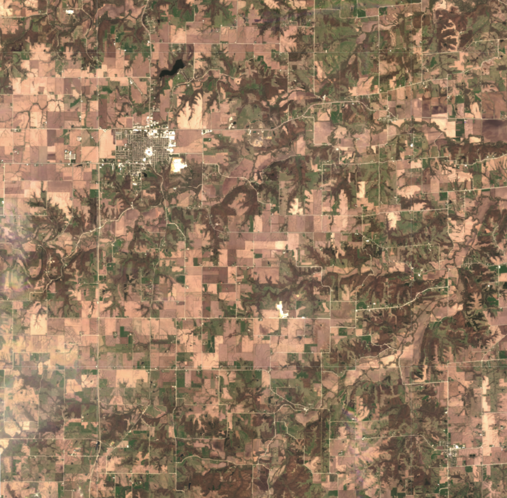

The example data is using Planet Sandox data. This data is restricted to Sentinel Hub users with active paid plans. If you are already a Planet Customer, see [here](https://community.planet.com/sentinel-hub-81/access-new-tools-for-analyzing-your-planet-data-on-sentinel-hub-732) on how to get access.

## General description
The true color product maps Analysis-Ready PlanetScope band values red, green, and blue which roughly correspond to red, green, and blue part of the spectrum, respectively, to R, G, and B components.

## Description of representative image

A true color visualization of Des Moines, United States (April 2023)

