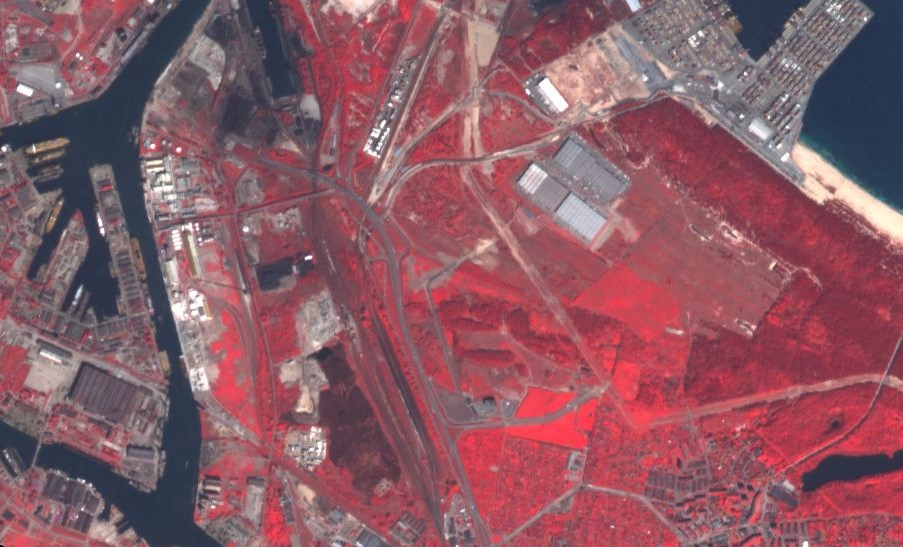

The example data is using Planet Sandox data. This data is restricted to Sentinel Hub users with active paid plans. If you are already a Planet Customer, see [here](https://community.planet.com/sentinel-hub-81/access-new-tools-for-analyzing-your-planet-data-on-sentinel-hub-732) on how to get access.

## General description

The [False color](https://en.wikipedia.org/wiki/False_color) infrared composite maps near-infrared spectral band `nir` with `red` and `green` bands to [sRGB](https://en.wikipedia.org/wiki/SRGB) components directly. It is most commonly used to assess plant density and healht, as plants reflect near infrared and green light, while absorbing red. Since they reflect more near infrared than green, plant-covered land appears deep red. Denser plant growth is darker red. Cities and exposed ground are gray or tan, and water appears blue or black.

## Description of representative images

False color composite of Rome. 

## References
- [1] Wikipedia, [False color](https://en.wikipedia.org/wiki/False_color). Accessed October 10th 2017.
- [2] Wikipedia, [sRGB](https://en.wikipedia.org/wiki/SRGB). Accessed October 10th 2017.
