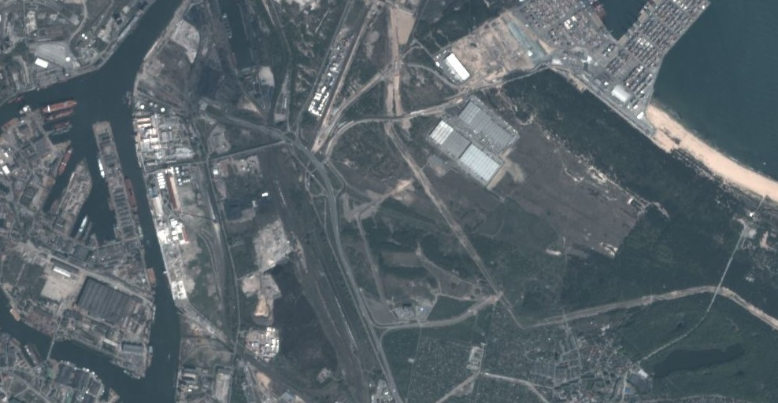

The example data is using Planet Sandox data. This data is restricted to Sentinel Hub users with active paid plans. If you are already a Planet Customer, see [here](https://community.planet.com/sentinel-hub-81/access-new-tools-for-analyzing-your-planet-data-on-sentinel-hub-732) on how to get access.

## General description

The true color product maps PlanetScope band values `red`, `green`, and `blue` which roughly correspond to red, green, and blue part of the spectrum, respectively, to R, G, and B components.

## Description of representative images

True color visualization of Rome.

## References
 - Wikipedia, [False color](https://en.wikipedia.org/wiki/False_color#True_color). Accessed October 10th 2017.
